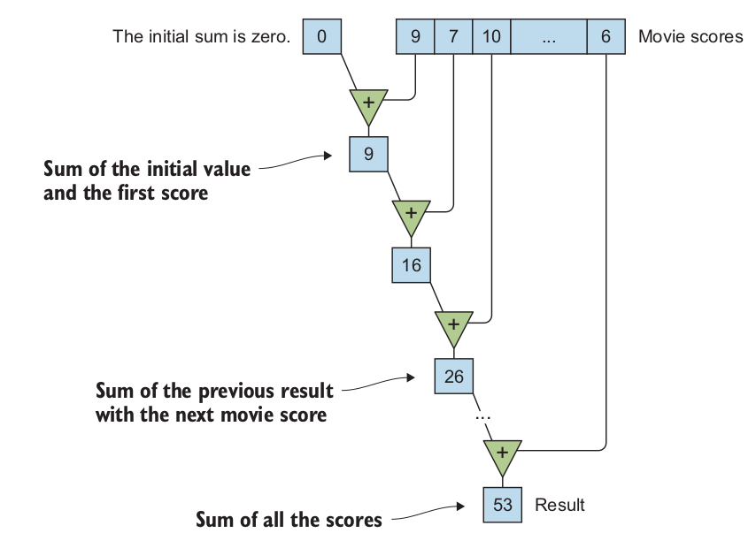

# 说明

《Functional Programming in C++》书中代码练习测试以及一些笔记

## 1 介绍

### 1.1 什么是函数式编程

- 用常用的函数范式模板代替一些循环等，比如`std::one_of()`,`std::count()`,`std::transform()`等
- 使用ranges（C++20）的管道操作`|`

### 1.2 纯函数

> 函数，只使用（但不修改）传递给它们的参数，以计算出结果

- OOP可以用更好的管理程序状态，但不能减少程序状态

例子，文本编辑器在按保存的时候用户输入了，该保存哪些？

- OOP通过封装活动部件使代码变得易懂。FP通过最大限度地减少活动部件来使代码易于理解。

比如在例子中计算多个文件的行数，如果计算时候文件在改写，那么就要考虑到不同的状态

这种写法可以规避掉`count_lines`的状态传递

```c++
std::vector<int> count_lines_in_files(const std::vector<std::string> &files)
{
    reuturn files | transform(count_lines);
}
```

避免状态改变逐层传递产生耦合！！

### 1.3 函数式思考

想着输入是什么，输出是什么，怎样把输入映射到输出，而不是算法的每一步去写代码

### 1.4 函数式编程的好处

#### 1.4.1 代码健壮和可读

函数式写法代码更加精炼

#### 1.4.2 并发和同步

共享改变状态是写并发时的问题。并发编程写纯函数，因为不改变状态，在单线程多线程一样使用

比如

```c++
std::vector<double> xs = {1, 2, 3, 4, ...};
auto result = sum(xs | transform(sqrt));
```

如果`sqrt`是纯函数，那么求和算法就可以切块累加然后合并了，不管是单线程还是多线程都可以运行

由于C++没有纯函数的标记，所以不能自动并行。如果是循环就没有那么轻易地实现并行了

> 注意，C++编译器在发现循环体为纯的时候会自动向量化或者做其他优化

#### 1.4.3 持续优化

## 2 开始函数式编程

### 2.1 函数把函数当参数

对于过滤人群的函数调用，可以总结为

```c++
filter: (collection<T>, (T → bool)) → collection<T>
```

而结构体的映射转换使用的`transform`原型为

```c++
transform: (collection<In>, (In → Out)) → collection<Out>
```

### 2.2 STL例子

#### 2.2.1 计算均值

通常做法

```c++
double average_score(const std::vector<int> &scores)
{
    int sum = 0;
    for (int score: scores) {
        sum += score;
    }
    return sum / (double) scores.size();
}
```

我们可以使用`std::accumulate`来实现：

```c++
double average_score(const std::vector<int> &scores)
{
    return std::accumulate(scores.cbegin(), scores.cend(), 0) /
           (double) scores.size();
}
```

并行版本的算法，需要使用`execution`里面的函数`std::reduce`

```c++
double average_score(const std::vector<int>& scores)
{
    return std::reduce(
            std::execution::par,
            scores.cbegin(), scores.cend(),
            0
    ) / (double) scores.size();
}
```

编译并行程序如果出现问题，例如

```
error: #error Intel(R) Threading Building Blocks 2018 is required; older versions are not supported.
```

需要编译最新版本的TBB库，教程在：<https://github.com/oneapi-src/oneTBB/blob/master/INSTALL.md>

#### 2.2.2 折叠

`std::accumulate`也可以自定义操作符，或者使用已经有的例如`std::multiplies`

`std::accumulate`是特殊的函数，会顺序执行，不能够进行并行化



使用`std::accumulate`计算行数

```c++
int f(int previous_count, char c)
{
    return (c != '\n') ? previous_count
                       : previous_count + 1;
}

int count_lines(const std::string & s)
{
    return std::accumulate(
        s.cbegin(), s.cend(),
        0,
        f
    );
}
```

该方法用`f`函数判断是否是回车符，自定义了`std::accumulate`的运算函数。如果需要从尾部运算到头部，把迭代器`cbegin`换成`crbegin`就可以了

#### 2.2.3 字符串修剪

需要用到的算法是`std::find_if`

```c++
bool is_not_space(char c)
{
    return c != ' ';
}

std::string trim_left(std::string s)
{
    s.erase(s.begin(),
            std::find_if(s.begin(), s.end(), is_not_space));
    return s;
}

std::string trim_right(std::string s)
{
    s.erase(std::find_if(s.rbegin(), s.rend(), is_not_space).base(),
            s.end());
    return s;
}

std::string trim(std::string s)
{
    return trim_left(trim_right(std::move(s)));
}
```

使用`base()`函数把反向迭代器转换成正向迭代器

#### 2.2.4 集合划分

使用`std::partition`和`std::stable_partition`可以把集合按照特定要求一分为二排列

比如把女性放队列前面

```c++
std::partition(
    people.begin(), people.end(),
    is_female
);
```

而两者的区别就是`std::partition`排列的时候不会考虑相同类之间元素的顺序，效率相对后者较高。而`std::stable_partition`会保持同类元素之间的相对顺序

#### 2.2.5 过滤和变换

使用`std::remove_if`过滤

```c++
people.erase(
    std::remove_if(people.begin(), people.end(),
                   is_not_female),
    people.end());
```

`std::remove`或者`std::remove_if`并不能真正的删除元素，而是把要删除的元素移动到末尾，配合`std::erase`来彻底删除元素

使用`std::copy_if`拷贝特定元素

```c++
std::vector<person_t> females;

std::copy_if(people.cbegin(), people.cend(),
             std::back_inserter(females),
             is_female);
```

`std::back_inserter`可以在原有集合的基础上提供向后插入的容器，由于`std::copy_if`事先并不知道需要拷贝多少元素，所以需要动态扩充的容器来进行拷贝

`std::copy_if`四个参数的原型

```c++
template<class InputIt, class OutputIt, class UnaryPredicate>
OutputIt copy_if(InputIt first, InputIt last, 
                 OutputIt d_first, UnaryPredicate pred)
{
    while (first != last) {
        if (pred(*first))
            *d_first++ = *first;
        first++;
    }
    return d_first;
}
```

可以看到`std::copy_if`并不会扩充目标容器

用`std::copy_if`除了拷贝到`std::back_inserter`容器里面还可以拷贝到流里面，比如

```c++
std::ostream_iterator<int>(std::cout, " ")
```

### 2.3 STL算法的兼容性问题

通常STL算法的兼容性都比手写循环兼容性好，比如以下找出所有女性并把名字存储记录的代码

```c++
std::vector<std::string> names;

for (const auto &person : people) {
    if (is_female(person)) {
        names.push_back(name(person));
    }
}
```

使用`transform`加上`filter`函数可以简洁，原型如下

```c++
filter      : (collection<T>, (T -> bool)) -> collection<T>
transform   : (collection<T>, (T -> T2)) -> collection<T2>
```

`filter`是C++20里面的，在`<ranges>`头文件里面

```c++
std::vector<std::string> names;
transform(filter(people, is_female), name);
```

利用`filter`过滤出符合的元素然后进行一对一的集合元素转换

使用该方法解决了两个算法之间存在中介变量的问题，比如需要生命临时的用来存女性的集合的数组

使用两次`std::copy_if`也能达到`std::stable_partition`的功能

```c++
std::vector<person_t> separated(people.size());

const auto last = std::copy_if(
    people.cbegin(), people.cend(),
    separated.begin(),
    is_female);

std::copy_if(
    people.cbegin(), people.cend(),
    last,
    is_not_female);
```

### 2.4 编写自己的高等级函数

很多STL算法在第三方库里面也有实现，比如Boost

#### 2.4.1 以变量的方式接收函数

例如

```c++
template <typename FilterFunction>
std::vector<std::string> names_for(
    const std::vector<person_t> &people,
    FilterFunction filter);
```

#### 2.4.2 使用循环实现

```c++
template <typename FilterFunction>
std::vector<std::string> names_for(
    const std::vector<person_t> &people,
    FilterFunction filter)
{
    std::vector<std::string> result;

    for (const person_t &person : people) {
        if (filter(person)) {
            result.push_back(name(person));
        }
    }

    return result;
}
```

#### 2.4.3 递归和尾随调用优化

上面用循环的方式，每次找到一个人，都会相应的更改结果

使用递归方式如下：

```c++
template <typename FilterFunction>
std::vector<std::string> names_for(
    const std::vector<person_t>& people,
    FilterFunction filter)
{
    if (people.empty()) {
        return {};
    } else {
        const auto head = people.front();
        const auto processed_tail = names_for(
                tail(people),
                filter);
        if (filter(head)) {
            return prepend(name(head), processed_tail);
        } else {
            return processed_tail;
        }
    }
}
```

该实现方式并不高效，`vector`并没有现成的`tail`函数，需要自己实现

另外一种实现方式如下：

```c++
template <typename FIlterFunction, typename Iterator>
std::vector<std::string> names_for(
    Iterator people_begin,
    Iterator people_end,
    FilterFunction filter)
{
    ...
    const auto processed_tail = names_for(
        people_begin + 1,
        people_end,
        filter);
    ...
}
```

第二种实现方法也会有每次都会在`vector`后面添加的情况，但是每次迭代占用的栈内存开销都很大，有些甚至会溢出崩溃

尾部递归的实现：

```c++
template <typename FilterFunction, typename Iterator>
std::vector<std::string> names_for_helper(
    Iterator people_begin,
    Iterator people_end,
    FilterFunction filter,
    std::vector<std::string> previously_collected)
{
    if (people_begin == people_end) {
        return previously_collected;
    }
    const auto head = *people_begin;
    
    if (filter(head)) {
        previously_collected.push_back(name(head));
    }

    return names_for_helper(
        people_begin + 1,
        people_end,
        filter,
        std::move(previously_collected));
}

// 调用函数
template <typename FilterFunction, typename Iterator>
std::vector<std::string> names_for_helper(
    Iterator people_begin,
    Iterator people_end,
    FilterFunction filter)
{
    names_for_helper(people_begin, people_end, filter, {});
}
```

#### 2.4.4 使用折叠实现

递归是一种低层次的结构，通常在春FP函数中会加以避免，前面说高层次的结构在FP里面更受欢迎，因为因为递归错综复杂

使用`std::accumulate`实现

```c++
std::vector<std::string> append_name_if(
    std::vector<std::string> previously_collected,
    const person_t &person)
{
    if (filter(person)) {
        previously_collected.push_back(name(person));
    }
    return previously_collected;
}

...

return std::accumulate(
    people.cbegin(),
    people.cend(),
    std::vector<std::string>{},
    append_name_if);
```

但是该例子里面有个重要的问题是拷贝次数太多了，每次调用`append_name_if`都会生成`previously_collected`的拷贝，C++20里面优化了`std::accumulate`的拷贝问题，也可以自己实现`move_accumulate`方法，以下是C++20优化后的实现

```c++
template<class InputIt, class T, class BinaryOperation>
constexpr // since C++20
T accumulate(InputIt first, InputIt last, T init, 
             BinaryOperation op)
{
    for (; first != last; ++first) {
        init = op(std::move(init), *first); // std::move since C++20
    }
    return init;
}
```

## 3 函数对象

### 3.1 函数和函数对象

两种不同的写法

```c++
int max(int arg1, int arg2) { ... }
auto max(int arg1, int arg2) -> int { ... }
```

#### 3.1.1 自动类型推导

```c++
int answer = 42;
auto ask1() { return answer; }
const auto &ask2() { return answer; }
```

