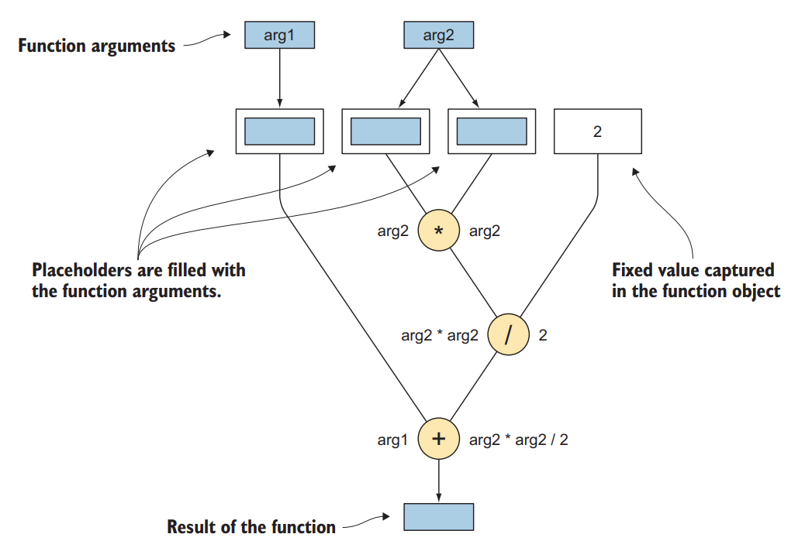

# 说明

《Functional Programming in C++》书中代码练习测试以及一些笔记

## 1 介绍

### 1.1 什么是函数式编程

- 用常用的函数范式模板代替一些循环等，比如`std::one_of()`,`std::count()`,`std::transform()`等
- 使用ranges（C++20）的管道操作`|`

### 1.2 纯函数

> 函数，只使用（但不修改）传递给它们的参数，以计算出结果

- OOP可以用更好的管理程序状态，但不能减少程序状态

例子，文本编辑器在按保存的时候用户输入了，该保存哪些？

- OOP通过封装活动部件使代码变得易懂。FP通过最大限度地减少活动部件来使代码易于理解。

比如在例子中计算多个文件的行数，如果计算时候文件在改写，那么就要考虑到不同的状态

这种写法可以规避掉`count_lines`的状态传递

```c++
std::vector<int> count_lines_in_files(const std::vector<std::string> &files)
{
    reuturn files | transform(count_lines);
}
```

避免状态改变逐层传递产生耦合！！

### 1.3 函数式思考

想着输入是什么，输出是什么，怎样把输入映射到输出，而不是算法的每一步去写代码

### 1.4 函数式编程的好处

#### 1.4.1 代码健壮和可读

函数式写法代码更加精炼

#### 1.4.2 并发和同步

共享改变状态是写并发时的问题。并发编程写纯函数，因为不改变状态，在单线程多线程一样使用

比如

```c++
std::vector<double> xs = {1, 2, 3, 4, ...};
auto result = sum(xs | transform(sqrt));
```

如果`sqrt`是纯函数，那么求和算法就可以切块累加然后合并了，不管是单线程还是多线程都可以运行

由于C++没有纯函数的标记，所以不能自动并行。如果是循环就没有那么轻易地实现并行了

> 注意，C++编译器在发现循环体为纯的时候会自动向量化或者做其他优化

#### 1.4.3 持续优化

## 2 开始函数式编程

### 2.1 函数把函数当参数

对于过滤人群的函数调用，可以总结为

```c++
filter: (collection<T>, (T → bool)) → collection<T>
```

而结构体的映射转换使用的`transform`原型为

```c++
transform: (collection<In>, (In → Out)) → collection<Out>
```

### 2.2 STL例子

#### 2.2.1 计算均值

通常做法

```c++
double average_score(const std::vector<int> &scores)
{
    int sum = 0;
    for (int score: scores) {
        sum += score;
    }
    return sum / (double) scores.size();
}
```

我们可以使用`std::accumulate`来实现：

```c++
double average_score(const std::vector<int> &scores)
{
    return std::accumulate(scores.cbegin(), scores.cend(), 0) /
           (double) scores.size();
}
```

并行版本的算法，需要使用`execution`里面的函数`std::reduce`

```c++
double average_score(const std::vector<int>& scores)
{
    return std::reduce(
            std::execution::par,
            scores.cbegin(), scores.cend(),
            0
    ) / (double) scores.size();
}
```

编译并行程序如果出现问题，例如

```
error: #error Intel(R) Threading Building Blocks 2018 is required; older versions are not supported.
```

需要编译最新版本的TBB库，教程在：<https://github.com/oneapi-src/oneTBB/blob/master/INSTALL.md>

#### 2.2.2 折叠

`std::accumulate`也可以自定义操作符，或者使用已经有的例如`std::multiplies`

`std::accumulate`是特殊的函数，会顺序执行，不能够进行并行化


使用`std::accumulate`计算行数

```c++
int f(int previous_count, char c)
{
    return (c != '\n') ? previous_count
                       : previous_count + 1;
}

int count_lines(const std::string & s)
{
    return std::accumulate(
        s.cbegin(), s.cend(),
        0,
        f
    );
}
```

该方法用`f`函数判断是否是回车符，自定义了`std::accumulate`的运算函数。如果需要从尾部运算到头部，把迭代器`cbegin`换成`crbegin`就可以了

#### 2.2.3 字符串修剪

需要用到的算法是`std::find_if`

```c++
bool is_not_space(char c)
{
    return c != ' ';
}

std::string trim_left(std::string s)
{
    s.erase(s.begin(),
            std::find_if(s.begin(), s.end(), is_not_space));
    return s;
}

std::string trim_right(std::string s)
{
    s.erase(std::find_if(s.rbegin(), s.rend(), is_not_space).base(),
            s.end());
    return s;
}

std::string trim(std::string s)
{
    return trim_left(trim_right(std::move(s)));
}
```

使用`base()`函数把反向迭代器转换成正向迭代器

#### 2.2.4 集合划分

使用`std::partition`和`std::stable_partition`可以把集合按照特定要求一分为二排列

比如把女性放队列前面

```c++
std::partition(
    people.begin(), people.end(),
    is_female
);
```

而两者的区别就是`std::partition`排列的时候不会考虑相同类之间元素的顺序，效率相对后者较高。而`std::stable_partition`会保持同类元素之间的相对顺序

#### 2.2.5 过滤和变换

使用`std::remove_if`过滤

```c++
people.erase(
    std::remove_if(people.begin(), people.end(),
                   is_not_female),
    people.end());
```

`std::remove`或者`std::remove_if`并不能真正的删除元素，而是把要删除的元素移动到末尾，配合`std::erase`来彻底删除元素

使用`std::copy_if`拷贝特定元素

```c++
std::vector<person_t> females;

std::copy_if(people.cbegin(), people.cend(),
             std::back_inserter(females),
             is_female);
```

`std::back_inserter`可以在原有集合的基础上提供向后插入的容器，由于`std::copy_if`事先并不知道需要拷贝多少元素，所以需要动态扩充的容器来进行拷贝

`std::copy_if`四个参数的原型

```c++
template<class InputIt, class OutputIt, class UnaryPredicate>
OutputIt copy_if(InputIt first, InputIt last, 
                 OutputIt d_first, UnaryPredicate pred)
{
    while (first != last) {
        if (pred(*first))
            *d_first++ = *first;
        first++;
    }
    return d_first;
}
```

可以看到`std::copy_if`并不会扩充目标容器

用`std::copy_if`除了拷贝到`std::back_inserter`容器里面还可以拷贝到流里面，比如

```c++
std::ostream_iterator<int>(std::cout, " ")
```

### 2.3 STL算法的兼容性问题

通常STL算法的兼容性都比手写循环兼容性好，比如以下找出所有女性并把名字存储记录的代码

```c++
std::vector<std::string> names;

for (const auto &person : people) {
    if (is_female(person)) {
        names.push_back(name(person));
    }
}
```

使用`transform`加上`filter`函数可以简洁，原型如下

```c++
filter      : (collection<T>, (T -> bool)) -> collection<T>
transform   : (collection<T>, (T -> T2)) -> collection<T2>
```

`filter`是C++20里面的，在`<ranges>`头文件里面

```c++
std::vector<std::string> names;
transform(filter(people, is_female), name);
```

利用`filter`过滤出符合的元素然后进行一对一的集合元素转换

使用该方法解决了两个算法之间存在中介变量的问题，比如需要生命临时的用来存女性的集合的数组

使用两次`std::copy_if`也能达到`std::stable_partition`的功能

```c++
std::vector<person_t> separated(people.size());

const auto last = std::copy_if(
    people.cbegin(), people.cend(),
    separated.begin(),
    is_female);

std::copy_if(
    people.cbegin(), people.cend(),
    last,
    is_not_female);
```

### 2.4 编写自己的高等级函数

很多STL算法在第三方库里面也有实现，比如Boost

#### 2.4.1 以变量的方式接收函数

例如

```c++
template <typename FilterFunction>
std::vector<std::string> names_for(
    const std::vector<person_t> &people,
    FilterFunction filter);
```

#### 2.4.2 使用循环实现

```c++
template <typename FilterFunction>
std::vector<std::string> names_for(
    const std::vector<person_t> &people,
    FilterFunction filter)
{
    std::vector<std::string> result;

    for (const person_t &person : people) {
        if (filter(person)) {
            result.push_back(name(person));
        }
    }

    return result;
}
```

#### 2.4.3 递归和尾随调用优化

上面用循环的方式，每次找到一个人，都会相应的更改结果

使用递归方式如下：

```c++
template <typename FilterFunction>
std::vector<std::string> names_for(
    const std::vector<person_t>& people,
    FilterFunction filter)
{
    if (people.empty()) {
        return {};
    } else {
        const auto head = people.front();
        const auto processed_tail = names_for(
                tail(people),
                filter);
        if (filter(head)) {
            return prepend(name(head), processed_tail);
        } else {
            return processed_tail;
        }
    }
}
```

该实现方式并不高效，`vector`并没有现成的`tail`函数，需要自己实现

另外一种实现方式如下：

```c++
template <typename FIlterFunction, typename Iterator>
std::vector<std::string> names_for(
    Iterator people_begin,
    Iterator people_end,
    FilterFunction filter)
{
    ...
    const auto processed_tail = names_for(
        people_begin + 1,
        people_end,
        filter);
    ...
}
```

第二种实现方法也会有每次都会在`vector`后面添加的情况，但是每次迭代占用的栈内存开销都很大，有些甚至会溢出崩溃

尾部递归的实现：

```c++
template <typename FilterFunction, typename Iterator>
std::vector<std::string> names_for_helper(
    Iterator people_begin,
    Iterator people_end,
    FilterFunction filter,
    std::vector<std::string> previously_collected)
{
    if (people_begin == people_end) {
        return previously_collected;
    }
    const auto head = *people_begin;
    
    if (filter(head)) {
        previously_collected.push_back(name(head));
    }

    return names_for_helper(
        people_begin + 1,
        people_end,
        filter,
        std::move(previously_collected));
}

// 调用函数
template <typename FilterFunction, typename Iterator>
std::vector<std::string> names_for_helper(
    Iterator people_begin,
    Iterator people_end,
    FilterFunction filter)
{
    names_for_helper(people_begin, people_end, filter, {});
}
```

#### 2.4.4 使用折叠实现

递归是一种低层次的结构，通常在春FP函数中会加以避免，前面说高层次的结构在FP里面更受欢迎，因为因为递归错综复杂

使用`std::accumulate`实现

```c++
std::vector<std::string> append_name_if(
    std::vector<std::string> previously_collected,
    const person_t &person)
{
    if (filter(person)) {
        previously_collected.push_back(name(person));
    }
    return previously_collected;
}

...

return std::accumulate(
    people.cbegin(),
    people.cend(),
    std::vector<std::string>{},
    append_name_if);
```

但是该例子里面有个重要的问题是拷贝次数太多了，每次调用`append_name_if`都会生成`previously_collected`的拷贝，C++20里面优化了`std::accumulate`的拷贝问题，也可以自己实现`move_accumulate`方法，以下是C++20优化后的实现

```c++
template<class InputIt, class T, class BinaryOperation>
constexpr // since C++20
T accumulate(InputIt first, InputIt last, T init, 
             BinaryOperation op)
{
    for (; first != last; ++first) {
        init = op(std::move(init), *first); // std::move since C++20
    }
    return init;
}
```

## 3 函数对象

### 3.1 函数和函数对象

两种不同的写法

```c++
int max(int arg1, int arg2) { ... }
auto max(int arg1, int arg2) -> int { ... }
```

#### 3.1.1 自动类型推导

```c++
int answer = 42;
auto ask1() { return answer; }
const auto &ask2() { return answer; }
```

使用`decltype(auto)`返回值

```c++
template <typename Object, typename Function>
decltype(auto) call_on_object(Object &&object, Function function)
{
    return function(std::forward<Object>(object));
}
```

**变量完美转发**

使用折叠引用和`std::forward`

#### 3.1.2 函数指针

```c++
int ask() { return 42; }

typedef decltype(ask) * function_ptr;

class convertible_to_function_ptr {
public:
    operator function_ptr() const   //函数指针callable_object
    {
        return ask;
    }
};

int main()
{
    auto ask_ptr = &ask;
    std::cout << ask_ptr() << '\n'; //调用函数指针

    auto ask_ref = ask;
    std::cout << ask_ref() << '\n'; //调用函数引用

    convertible_to_function_ptr ask_wrapper;
    std::cout << ask_wrapper() << '\n'; // 对象转换成函数指针
}

```

#### 3.1.3 重载调用操作符

语法：

```c++
class function_object {
public:
    return_type operator()(arguments) const
    {
        ...
    }
};
```

要取出年龄大于42岁的人，通常可以这么做

```c++
bool older_than_42(const person_t& person)
{
    return person.age > 42;
}
std::count_if(persons.cbegin(), persons.cend(),
              older_than_42);
```

但是这种方式并不通用，更加通用的办法是创建一个callable类，把42当构造参数传入

```c++
class older_than
{
public:
    older_than(int limit) : m_limit(limit) {}
    bool operator() (const person_t &person) const
    {
        return person.age() > m_limit;
    }

private:
    int m_limit;
}

older_than older_than_42(42);

std::count_if(persons.cbegin(), persons.cend(),
              older_than(42));
```

`std::count_if`并不需要传入参数为函数指针，只需要是能够被调用的就行

#### 3.1.4 创建通用函数对象

用于通用对象的比较函数对象

```c++
template<typename T>
class older_than {
public:
    older_than(int limit) :
            m_limit(limit) {}
    bool operator()(const T &object) const
    {
        return object.age() > m_limit;
    }
private:
    int m_limit;
};

std::count_if(persons.cbegin(), persons.cend(),
              older_than<person_t>(42));
std::count_if(cars.cbegin(), cars.cend(),
              older_than<car_t>(5));
std::count_if(projects.cbegin(), projects.cend(),
              older_than<project_t>(42));
```

上面函数对象以来类型来创建，通过只设置单个函数为模板函数创建能够自动推导类型的函数对象模板，使其更加通用

```c++
class older_than {
public:
    older_than(int limit) : m_limit(limit) {}
    template<typename T>
    bool operator()(T &&object) const
    {
        return std::forward<T(object).age() > m_limit;
    }
};

older_than predicate(5);
std::count_if(persons.cbegin(), persons.cend(), predicate);
std::count_if(cars.cbegin(), cars.cend(), predicate);
std::count_if(projects.cbegin(), projects.cend(), predicate);
```

### 3.2 Lambda表达式和闭包

使用$\lambda$表达式

```c++
std::copy_if(people.cbegin(), people.cend(),
             std::back_inserter(females),
             [](const person_t& person) {
                 return person.gender() == person_t::female;
             }
        );
```

#### 3.2.1 Lambda表达式语法

```c++
[a, &b] (int x, int y) { return a * x + b * y; }
   头         变量                函数体
```

不同函数头的作用

- `[a, &b]` —— a值抓取，b引用抓取
- `[]` —— 不使用附近作用域
- `[&]` —— 引用抓取所有函数体用过的变量
- `[=]` —— 值抓取所有函数体用过的变量
- `this` —— 抓取`this`指针
- `[&, a]` —— 除了`a`按值抓取，其他都按引用抓取
- `[=, &b]` —— 除了`b`按引用抓取，其他都按值抓取

#### 3.2.2 使用lambda表达式

```c++
class company_t {
public:
    std::string team_name_for(const person_t &employee) const;
    int count_team_members(const std::string &team_name) const;

private:
    std::vector<person_t> m_employees;
    ...
};

int company_t::count_team_members(const std::string &team_name) const
{
    return std::count_if(
            m_employees.cbegin(), m_employees.cend(),
            [this, &team_name](const person_t &employee) {
                return team_name_for(employee) == team_name;
            }
        );
}

```

使用`mutable`关键字标记的lambda表达式可以告诉编译器这个lambda上的调用操作符不应该是常数

```c++
int count = 0;
std::vector<std::string> words{"An", "ancient", "pond"};

```

> 当声明一个lambda表达式，编译器就会声明一个callable类，`()`操作符为函数

#### 3.2.3 在lambdas中创建任意的成员变量

使用值抓取move only类型`std::unique_ptr`时会有问题

```c++
std::unique_ptr<sesson_t> session = create_sesson();
auto request = server.request("GET /", session->id());
request.on_complete(
            [session]
            (response_t response)
            {
                std::cout << "Got response: " << response
                          << " for session: " << session;
            }
        );
```

上述方式会报错，需要在抓取的时候使用移动语义`std::move`

```c++
request.on_complete(
            [ session = std::move(session),
              time = current_time()
            ]
            (response_t response)
            {
                std::cout << "Got response: " << response
                          << " for session: " << session
                          << " the request took: "
                          << (current_time() - time)
                          << "milliseconds";
            }
        );
```

`time`在创建该匿名函数时就已经定义好了，无论后续在哪里调用

#### 3.2.4 通用lambda表达式

lambda表达式参数支持auto关键字，能够根据调用入参自己选择类型

```c++
auto predicate = [limit = 42] (auto &&object) {
    return object.age() > limit;
}

std::count_if(persons.cbegin(), persons.cend(),
              predicate);
std::count_if(cars.cbegin(), cars.cend(),
              predicate);
std::count_if(projects.cbegin(), projects.cend(),
              predicate);
```

C++20中更加通用的lambda表达式

支持使用decltype

```c++
[] (auto first, decltype(first) second) { … }
```

或者使用模板

```c++
[] <typename T> (T first, T second) { … }
```

### 3.3 编写比lambda表达式更复杂的函数对象

写过滤函数需要重复很多代码

```c++
ok_response = filter(response, 
        [] (const response_t &response) {
            return !response.error();
        });

failed_response = filter(response,
        [] (const response_t &response) {
            return response.error();
        });
```

理想的调用方式是这样的

```c++
ok_response = filter(response, not_error);
// 或者        filter(response, !error);
// 或者        filter(response, error == false);

failed_response = filter(response, error);
// 或者            filter(response, not_error == false);
// 或者            filter(response, error == true);
```

需要定义一个类，存储一个`bool`类型

```c++
class error_test_t {
public:
    error_test_t(bool error = true) : m_error(error) {}
    template <typename T>
    bool operator()(T &&value) const
    {
        return m_error == (bool) std::forward<T>(value).error();
    }

private:
    bool m_error;
};

error_test_t error(true);
error_test_t not_error(false);
```

如果需要支持`!`操作，还要重载该操作符

```c++
class error_test_t {
public:
    ...
    error_test_t operator==(bool test) const
    {
        return error_test_t(
            test ? m_error : !m_error
        );
    }

    error_test_t operator!() const
    {
        return error_test_t(!m_error);
    }
};
```

#### 3.3.1 STL中的操作符函数对象

STL中的操作符函数对象可以用在排序和累计中

```c++
std::vector<int> numbers{1, 2, 3, 4};
product = std::accumulate(numbers.cbegin(), numbers.cend(), 1,
                          std::multiplies<int>());
std::vector<int> numbers{5, 21, 13, 42};
std::sort(numbers.begin(), numbers.end(), std::greater<int>());
// numbers now contain {42, 21, 13, 5}
```

```c++
// 算术操作
std::plus
std::minus
std::multiplies
std::divides
std::modulus    // %
std::negates    // -a

// 比较操作
std::equal_to
std::not_equal_to
std::greater
std::less
std::greater_equal
std::less_equal

// 逻辑操作
std::logical_and
std::logical_or
std::logical_not

// 位操作
std::bit_and
std::bit_or
std::bit_xor
```

C++14中，在使用标准库中的运算符包装器时，你可以省略该类型。直接使用`std::greater<>()`，而不是`std::greater<int>()`

#### 3.3.2 其他库中的操作符函数对象

Boost库。比如Boost库中的`phoenix`

```c++
using namespace boost::phoenix::arg_names;
std::vector<int> numbers{21, 5, 62, 42, 53};
std::partition(numbers.begin(), numbers.end(),
               arg1 <= 42);
// numbers now contain {21, 5, 42, 62, 53}
//                         <= 42    > 42
```

`arg1`为定义的占位符，该函数代表按照第一个变量把集合划分开

然后还可以运用在其他上，比如累加

```c++
std::accumulate(numbers.cbegin(), numbers.cend(), 0, 
                arg1 + arg2 * arg2 / 2);
```



也可以算乘法或者进行排序

```c++
product = std::accumulate(numbers.cbegin(), numbers.cend(), 1,
                          arg1 * arg2);
std::sort(numbers.begin(), numbers.end(), arg1 > arg2);
```

### 3.4 使用std::function包装函数

```c++
std::function<float (float, float)> test_function;
test_function = std::fmaxf;                     // 函数
test_function = std::multiplies<float>();       // 类的调用函数
test_function = std::multiplies<>();            // 类通用调用函数
test_function = [x] (float a, float b) { return a * x + b; };   // lambda表达式
test_function = [x] (auto a, auto b) { return a * x + b; };     // 通用lanbda表达式
test_function = (arg1 + arg2) / 2;              // boost.phoenix 表达式
test_function = [](std::string s) { return s.empty(); } // 错误
```

`std::function`本质上是重载了`()`操作符的可调用类（callable）

`std::function`在绑定函数时需要用到`std::ref`确保是引用传参

```c++
std::function<void()> bound_f = std::bind(f, n1, std::ref(n2), std::cref(n3));
```

## 4 从旧的函数创建新的函数

### 4.1 部分功能的应用

之前的比较是用模板的形式，涉及到具体对象的方法，并不通用，下面采用的是重载调用操作符

```c++
class greater_than {
public:
    greater_than(int value) : m_value {}
    bool operator()(int arg) const
    {
        return arg > m_value;
    }
private:
    int m_value;
};
...

greater_than greater_than_42(42);
greater_than_42(1);     // false
greater_than_42(50);    // true

std::partition(xs.begin(), xs.end(), greater_than(6));
```

#### 4.1.1 将二元操作函数转换为单一函数的通用方法

更通用的方式封装别的用户的二元操作函数，比如说`>`是两个操作变量，greater_than把一个变量构造函数传入进去，变成一个一元函数

```c++
template<typename Function, typename SecondArgType>
class partial_application_on_2nd_impl {
public:
    partial_application_on_2nd_impl(Function function,
                                    SecondArgType second_arg)
        : m_function(function)
        , m_value(second_arg)
    {}

    template<typename FirstArgType>
    auto operator()(FirstArgType &&first_arg) const
        -> decltype(m_function(
                std::forward<FirstArgType>(first_arg),
                m_second_arg))
    {
        return m_function(
                std::forward<FirstArgType>(first_arg),
                m_second_arg);
    }

    ...
private:
    Function m_function;
    SecondArgType m_second_arg;
};

// 绑定函数
template<typename Function, typename SecondArgType>
partial_application_bind2nd_impl<Function, SecondArgType>
bind2nd(Function &&function, SecondArgType &&second_arg)
{
    return partial_application_bind2nd_impl<Function, SecondArgType>(
            std::forward<Function>(function),
            std::forward<SecondArgType>(second_arg));
}

auto greater_than_42 = bind2nd(std::greater<int>(), 42);

greater_than_42(1);     // false
greater_than_42(50);    // true
```

使用`bind2nd`把角度转换成弧度

```c++
// 把角度转换成弧度
std::vector<double> degrees = {0, 30, 45, 60};
std::vector<double> radians(degrees.size());

std::transform(degrees.cbegin(), degrees.cend(),
               radians.begin(),
               bind2nd(std::multiplies<double>, PI / 180));
```

#### 4.1.2 使用std::bind指定函数变量

`std::bind1st`和`std::bind2nd`都被弃用了,可以使用`std::bind`

```c++
auto bound = std::bind(std::greater<double>(), _1, 42);
bool is_6_greater_than_42 = bound(6);
```

占位符`_1`和`_2`在`<functional>`头文件的命名空间`std::placeholders`里面

通过绑定不同的占位符变为不同的操作

```c++
auto is_greater_than_42 =
    std::bind(std::greater<double>(), _1, 42);
auto is_less_than_42 =
    std::bind(std::greater<double>(), 42, _1);
```

#### 4.1.3 反转二元操作函数的变量

可以把`_1`和`_2`位置调换，使得变量传入也交换

```c++
std::sort(scores.begin(), scores.end(),
          std::bind(std::greater<double>, _2, _1));
```

#### 4.1.4 使用std::bind处理更多变量的函数

```c++
enum output_format_t
{
    name_only,
    full_name,
};

void print_person(const person_t &person,
                  std::ostream &out,
                  person_t::output_format_t format);

std::for_each(people.cbegin(), people.cend(),
        std::bind(print_person,
                  _1,
                  std::ref(std::cout),
                  person_t::name_only
            ));
```

也可以绑定类成员函数，比如`print`在`person_t`中

```c++
class person_t {
public:
    ...
    void print(std::ostream &out, person_t::output_format_t format);
}

std::for_each(people.cbegin(), people.cend(),
        std::bind(&person_t::print,
                 _1,
                 std::ref(std::cout), 
                 person_t::name_only
            ));
```

#### 4.1.5 使用lambda表达式替代std::bind

```c++
auto is_greater_than_42 = 
    [] (double value) {
        return std::greater<double>()(value, 42);
    };

auto is_less_than_42 = 
    [] (double value) {
        return std::greater<double>()(42, value);
    };
```

排序的实现

```c++
std::sort(scores.begin(), scores.end(),
          [] (double value1, double value2) {
              return std::greater<double>()(value2, value1);
          });
```

打印的实现

```c++
std::for_each(people.cbegin(), people.cend(),
              [] (const person_t &person) {
                  print_person(person,
                               std::cout,
                               person_t::name_only);
              });
std::for_each(people.cbegin(), people.cend(),
              [&file] (const person_t &person) {
                  print_person(person,
                               file,
                               person_t::name_only);
              });
```

### 4.2 Currying:不同的方式看函数

柯理化（currying）：从Haskell引进的词汇，把一个多参数函数转换成单参数函数, 并且返回一个能接受余下参数并返回结果的新函数。

例如，一个函数f0需要输出2个参数，Currying后，第一个函数f1接收第一个参数a1后返回一个函数f2，f2接受第二个参数a2后返回最终结果

```c++
// 正常版本的调用
int result = f0(10, 2);
 
// Currying版本的调用
auto f1 = f0(10);
int f2 = f1(2);
```

大于函数的Currying版本

```c++
// greater : (double, double) -> bool
bool greater(double first, double second)
{
    return first > second;
}

// greater_curried : double → (double → bool)
auto greater_curried(double first)
{
    return [first] (double second) {
        return first > second;
    }
}

greater(2, 3);          // false
greater_curried(2);     // 返回函数对象
greater_curried(2)(3);  // false
```

#### 4.2.1 更方便的创建Currying函数的方式

```c++
auto print_person_cd(const person_t &person)
{
    return [&] (std::ostream &out) {
        return [&] (person_t::output_format_t format) {
            print_person(person, out, format);
        }
    }
}
```

使用`make_curried`，后面第11章节会提供代码

```c++
using std::cout;

auto print_person_cd = make_curried(print_person);

// 所有的方式都可以调用
print_person_cd(martha, cout, person_t::full_name);
print_person_cd(martha)(cout, person_t::full_name);
print_person_cd(martha, cout)(person_t::full_name);
print_person_cd(martha)(cout)(person_t::full_name);

auto print_martha = print_person_cd(martha);
print_martha(cout, person_t::name_only);

auto print_martha_to_cout = print_person_cd(martha, cout);
print_martha_to_cout(person_t::name_only);
```

注意并不是所有的调用方式都可以，必须确保按照变量输入的先后顺序来进行

#### 4.2.2 使用Currying处理数据库权限

```c++
result_t query(connection_t &connection,
               session_t &session,
               const std::string &table_name,
               const std::string &filter);
```

考虑单一数据库，单一连接情况，创建一个query函数，使其能够满足以下API操作

```c++
auto table = "Movies";
auto filter = "Name = \"Sintel\"";
results = query(local_connection, session, table, filter);
auto local_query = query(local_connection);
auto remote_query = query(remote_connection);
results = local_query(session, table, filter);
auto main_query = query(local_connection, main_session);
results = main_query(table, filter);
auto movies_query = main_query(table);
results = movies_query(filter);
```

#### 4.2.3 Currying和部分函数应用

> 部分函数应用（Partial function application）：部分函数的应用是指以少于其总参数数的方式调用一个多参数函数。这将导致一个新的函数接受剩余的参数数。通过部分函数应用创建的简单函数是非常有用的，而且通常比匿名函数的语法要求要少得多^[1]。

部分函数应用可以改变绑定变量顺序，而Currying先绑定第一个变量，这个是区别

```c++
auto local_query = query(local_connection); 
auto local_query = std::bind(query, local_connection, _1, _2, _3); 
auto session_query = std::bind(query, _1, main_session, _2, _3); 
```

当你有一个特定的函数，你想绑定它的参数时，部分函数应用很有用。在这种情况下，你知道这个函数有多少个参数，你可以准确地选择你想绑定到一个特定的值的参数。当你可以得到一个有任意数量参数的函数时，Currying在一般情况下特别有用。因为在这种情况下，不知道变量个数意味着`std::bind`就不能实现。

### 4.3 函数构成

《编程珠玑》里面的“读取一个文本文件，确定最常使用的n个词，并打印出这些词的排序列表及其频率。”问题，Doug McIlroy的UNIX shell脚本解决方式：

```shell
tr -cs A-Za-z '\n' |
    tr A-Z a-z |
    sort |
    uniq -c |
    sort -rn |
    sed ${1}q
```

用C++来解决该问题的转换步骤：

1. 有一个文件。从里面把单词分出来
2. 把分出来的单词放到无序map里面`std::unordered_map<std::string, unsigned int>`，把每个单词的数目记录
3. 遍历map中的元素，把map转换成pair，并且数目在前
4. 排序
5. 打印

我们可以创建根据其他元素类型容器决定元素类型的容器

```c++
template <typename C,
          typename T = typename C::value_type>
std::unodered_map<T, unsigned int> count_occurrences(const C &collection);
```

最终看起来的形式

```c++
void print_common_words(const std::string& text)
{
    return print_pairs(
        sort_by_frequency(
            reverse_pairs(
                count_occurrences(
                    words(text)
                )
            )
        )
    );
}
```

### 4.4 再谈函数提升

提升（lifting）是一个编程术语，给你提供了一种方法，将一个给定的函数转化为一个适用于更广泛背景的类似函数。

> 提升是一个概念，它允许你将一个函数转化为另一个（通常是更一般的）环境中的相应函数。^[2]

拿字符串转大写举例

```c++
void to_upper(std::string &string);
```

实现方法比如：

```c++
void pointer_to_upper(std::string* str) 
{ 
    if (str) to_upper(*str); 
}

void vector_to_upper(std::vector<std::string>& strs) 
{ 
    for (auto& str : strs) { 
        to_upper(str); 
    } 
}

void map_to_upper(std::map<int, std::string>& strs) 
{ 
    for (auto& pair : strs) { 
        to_upper(pair.second); 
    } 
} 
```

这种实现方法看起来毫无价值，实现取决于容器类型，不得不去实现针对各种变量类型的方法

应该创建一个high-order函数，只关注于操作单一的字符串，和一个函数处理字符串指针，创建一个函数处理字符串向量和字符串map。这些函数称为提升函数，因为它们将对某一类型进行操作的函数提升到一个结构或包含该类型的集合。

使用C++14特性来实现

```c++
void to_upper(std::string &string);

// 指针提升
template <typename Function>
auto pointer_lift(Function f)
{
    return [f] (auto *item) {
        if (item) {
            f(*item);
        }
    }
}

// 集合提升
template <typename Function>
auto collection_lift(Function f)
{
    return [f] (auto &items) {
        for (auto &item : items) {
            f(item);
        }
    };
}

// 例子
std::string str{"lift"};
std::string *pstr = new std::string{"lift"};
std::vector<std::string> vstr{"lift", "function"};
to_upper(str);
pointer_lift(to_upper)(pstr);
collection_lift(to_upper)(vstr);
```

#### 4.4.1 颠倒成对的列表

在之前那个问题中，第3步，涉及需要把map转化成pair集合并且数目要提到前面去，代码如下

```c++
template <typename C,
          typename P1 = typename std::remove_cv<
                typename C::value_type::first_type>::type,
          typename P2 = typename C::value_type::second_type
          >
std::vector<std::pair<P2, P1>> reverse_pairs(const C &items)
{
    std::vector<std::pair<P2, P1>> result(item.size());
    std::transform(
        std::begin(items), std::end(items),
        std::begin(result),
        [] (const std::pair<const P1, P2> &p) {
            return std::make_pair(p.second, p.first);
        }
    );
    return result;
}
```

`std::remove_cv`可以移除`const`和`volatile`

## 5 纯粹:避免可变状态

### 5.1 可变状态的问题

例如电影类`movie_t`

```c++
// 电影类
class movie_t {
public:
    double average_score() const;
    ...

private:
    std::string name;
    std::list<int> scores;
};

// 计算平均评分的方法
double movie_t::average_score() const
{
    return std::accumulate(scores.begin(),
                           scores.end(), 0)
            / (double) scores.size();
}
```

问题出现在当你在计算平均分时别人在添加分数，新添加的可能在里面也可能不在里面。`.size()`函数可能返回的时之前的大小。也就是迭代器事先确定好了，但是计算的时候又加了元素，所以size会变大，平均值变小了。

C++11之前的`std::list`并不会保存列表大小，所以每次都会重新遍历计算。所以需要在电影类里面自己存储一个`size`

```c++
class movie_t {
public:
    double average_score() const;
    ...

private:
    std::string name;
    std::list<int> scores;
    size_t scores_size;
};
```

但是这样做的坏处时当项目越来越大，这种变量越来越多，重构的难度就越来越大。需要确保变量在使用的时候不可被修改。

### 5.2 纯粹的函数和指称的透明度

这些问题都来自一个设计缺陷：让软件系统中的几个组件负责相同的数据，而不知道另一个组件何时改变该数据。避免该问题出现的最简单的办法是禁止数据改动。

但是说起来简单做起来难。很多时候和用户交互面临这个问题。保存的时候用户在进行输入，一个按钮按下，其他按钮不知道用户鼠标点击了什么。

但是如果不提交改变任何状态，就不可能做任何事。只能计算你自己传入参数的程序。你不能
做交互程序，不能保存数据到磁盘或者数据库，不能发送网络请求等。程序就毫无用处。

首先还是理解纯和不纯函数。第1章说纯函数只使用传递给它们的参数值，以便返回结果。它们不需要有任何副作用来影响你程序中的任何其他函数或你系统中的任何其他程序。纯函数还需要在用相同的参数调用时总是返回相同的结果。

现在通过一个概念名为引用透明性(referential transparency)更精确的定义纯粹，引用透明性是表达式的一个特征，而不仅仅是函数。我们可以说表达式是任何指定计算并返回结果的东西。如果我们把整个表达式替换成它的返回值，程序的行为也不会有什么不同，我们就说表达式是引用透明性的。如果一个表达式是引用透明性的，那么它就没有可观察到的副作用，因此该表达式中使用的所有函数都是纯的。

> 参考透明度，是函数式编程中常用的一个术语，意味着给定一个函数和一个输入值，你将总是收到相同的输出。这就是说，在函数中没有使用外部状态。
> 也就是函数的输出只取决于他的输入^[3]

例如

```c++
// 全局变量G
int G = 10;

// 引用透明
int pulsOne(int x)
{
    return x + 1;
}

// 非引用透明
int plusG(int x)
{
    return x + G;
}
```

## 参考

[^1]: [Partial Function Application in Haskell](https://blog.carbonfive.com/partial-function-application-in-haskell)

[^2]: [Lifting](https://wiki.haskell.org/Lifting)

[^3]: [What is referential transparency?](https://stackoverflow.com/questions/210835/what-is-referential-transparency)
